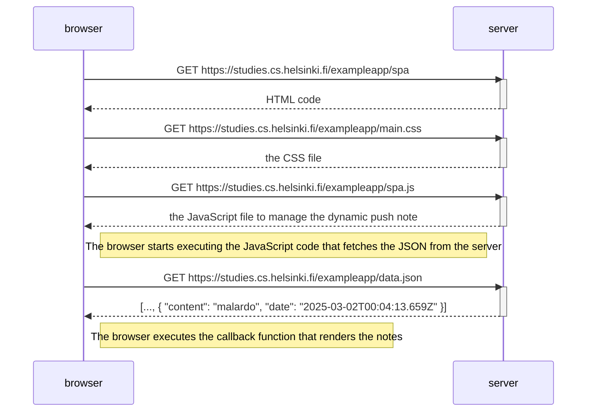

# Exercise 0.5

The following diagram illustrates the interaction between the browser and the server when the <https://studies.cs.helsinki.fi/exampleapp/spa> page is opened.

```mermaid
sequenceDiagram
    participant browser
    participant server

    browser->>server: GET https://studies.cs.helsinki.fi/exampleapp/spa
    activate server
    server-->>browser: HTML code
    deactivate server

    browser->>server: GET https://studies.cs.helsinki.fi/exampleapp/main.css
    activate server
    server-->>browser: the CSS file
    deactivate server

    browser->>server: GET https://studies.cs.helsinki.fi/exampleapp/spa.js
    activate server
    server-->>browser: the JavaScript file to manage the dynamic push note
    deactivate server

    Note right of browser: The browser starts executing the JavaScript code that fetches the JSON from the server

    browser->>server: GET https://studies.cs.helsinki.fi/exampleapp/data.json
    activate server
    server-->>browser: [..., { "content": "malardo", "date": "2025-03-02T00:04:13.659Z" }]
    deactivate server

    Note right of browser: The browser executes the callback function that renders the notes
```
