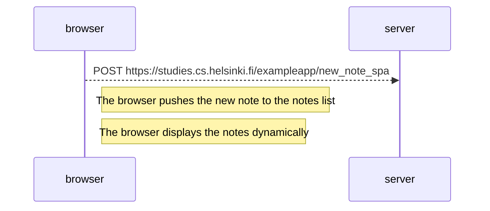

# Exercise 0.6

The following diagram illustrates the interaction between the browser and the server when a new note is added on the <https://studies.cs.helsinki.fi/exampleapp/spa> page.

```mermaid
sequenceDiagram
    participant browser
    participant server

    browser-->>server: POST https://studies.cs.helsinki.fi/exampleapp/new_note_spa

    Note right of browser: The browser pushes the new note to the notes list

    Note right of browser: The browser displays the notes dynamically
```
